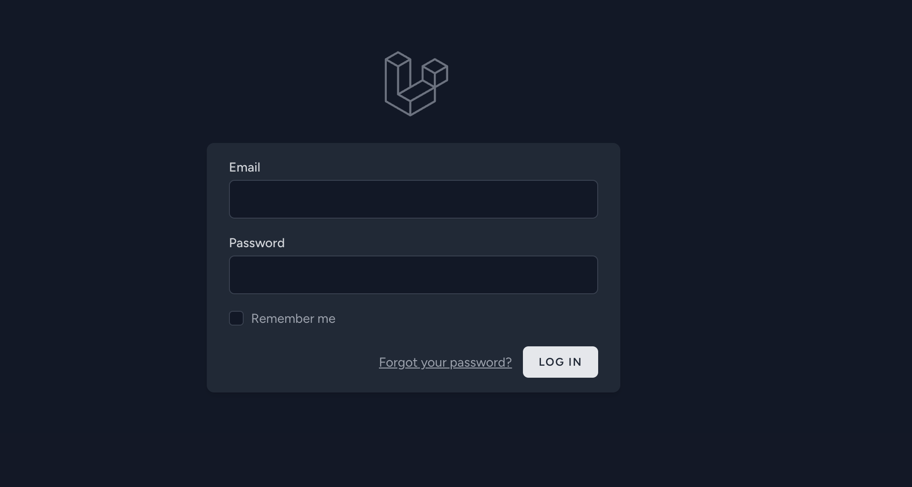
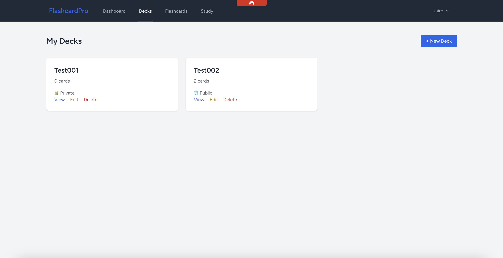
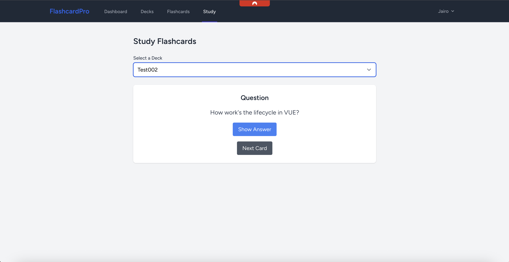
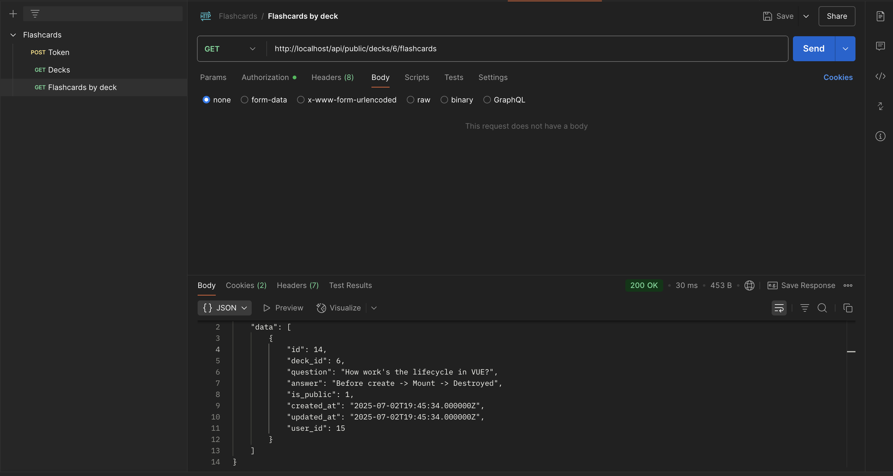

# 📘 FlashcardPro

**FlashcardPro** is a Laravel + Livewire application that allows users to create, manage, and study flashcards grouped into decks.  
This project was developed as part of a technical assessment for the Laravel Developer position at **Awesome Motive**.

---

## 👤 Developer

**Jairo Mendieta**  
📧 j4iro.a@gmail.com  
🔗 [GitHub Profile](https://github.com/jairox01)

---

## ⚙️ Tech Stack

- Laravel 11.x
- PHP 8.3
- Laravel Sail (Docker)
- Laravel Livewire
- Tailwind CSS
- MySQL (Dockerized)
- Eloquent ORM
- Pest & PHPUnit

---

## 🚀 Setup Instructions

1. **Clone the repository:**

```bash
git clone git@github-personal:jairox01/flashcardpro.git
cd flashcardpro
```

2. **Copy the environment configuration:**

```bash
cp .env.example .env
```

3. **Start the development environment using Laravel Sail:**

```bash
./vendor/bin/sail up -d
```

4. **Install dependencies:**

```bash
./vendor/bin/sail composer install
```

5. **Generate the application key:**

```bash
./vendor/bin/sail artisan key:generate
```

6. **Run migrations and seeders:**

```bash
./vendor/bin/sail artisan migrate:fresh --seed
```

7. **Access the application:**

```
http://localhost
```

---

## ✅ Features Implemented

### 🔐 Authentication

- User registration & login
- Auth-protected routes and features
- API token generation with Laravel Sanctum

### 🧠 Flashcards & Deck Management

- Full CRUD for decks and flashcards
- Deck → Flashcard (One-to-Many)
- Form validation using Form Requests
- Access control via Laravel Policies

### 📚 Study Mode (Livewire)

- Study cards from selected deck
- Flip card-style UI to show answers
- Smooth reactivity via Livewire (no full-page reloads)

### 🔓 Public API (Token-Protected)

- `POST /api/token`: generate API token
- `GET /api/public/decks`: retrieve public decks
- `GET /api/public/decks/{deck}/flashcards`: retrieve public flashcards by deck
- Custom middleware for public API request logging

### 🧪 Testing

- Pest-based test suite with over 95% feature coverage:
  - Token-based API auth
  - Authenticated/unauthenticated flows
  - Study deck logic
  - Deck & flashcard access control

---

## 🧪 Running Tests

```bash
./vendor/bin/sail test
```

---

## 📁 Project Structure (Simplified)

```
app/
├── Http/
│   ├── Controllers/
│   ├── Livewire/
│   └── Middleware/
├── Models/
├── Policies/
├── Services/
routes/
├── web.php
├── api.php
resources/
├── views/
└── livewire/
```

---

## 🧠 Architectural Notes

- **Livewire** provides dynamic behavior with minimal JS
- **Sanctum + middleware** ensure protected API access
- **Form Requests** encapsulate all validation logic
- **Authorization Policies** protect user-specific data
- **Seeders & factories** provide consistent test/demo data
- Docker-based environment via **Laravel Sail**

---

## 🤖 AI Tool Usage Disclosure

| Tool           | Area                     | Purpose                                           |
|----------------|--------------------------|---------------------------------------------------|
| ChatGPT        | Architecture, logic       | Route structure, seeders, Livewire scaffolding    |
| GitHub Copilot | Boilerplate               | Factories, requests, test structure               |
| ChatGPT        | Tests & docs              | Pest specs, README.md formatting & refinement     |

> All AI-assisted code was reviewed, tested, and aligned with Laravel 11 best practices.

---

## 🖼️ Screenshots

### 🔐 Login & Registration


### 📚 Deck Listing


### 🧠 Study Mode



### 📲 API Test via Postman


---

## 📌 Laravel & PHP Versions

- **PHP:** 8.3  
- **Laravel:** 11.x

---

## 📎 Development Environment

- Laravel Sail (Docker)
- MySQL (via Docker)
- `.env.example` included for configuration
